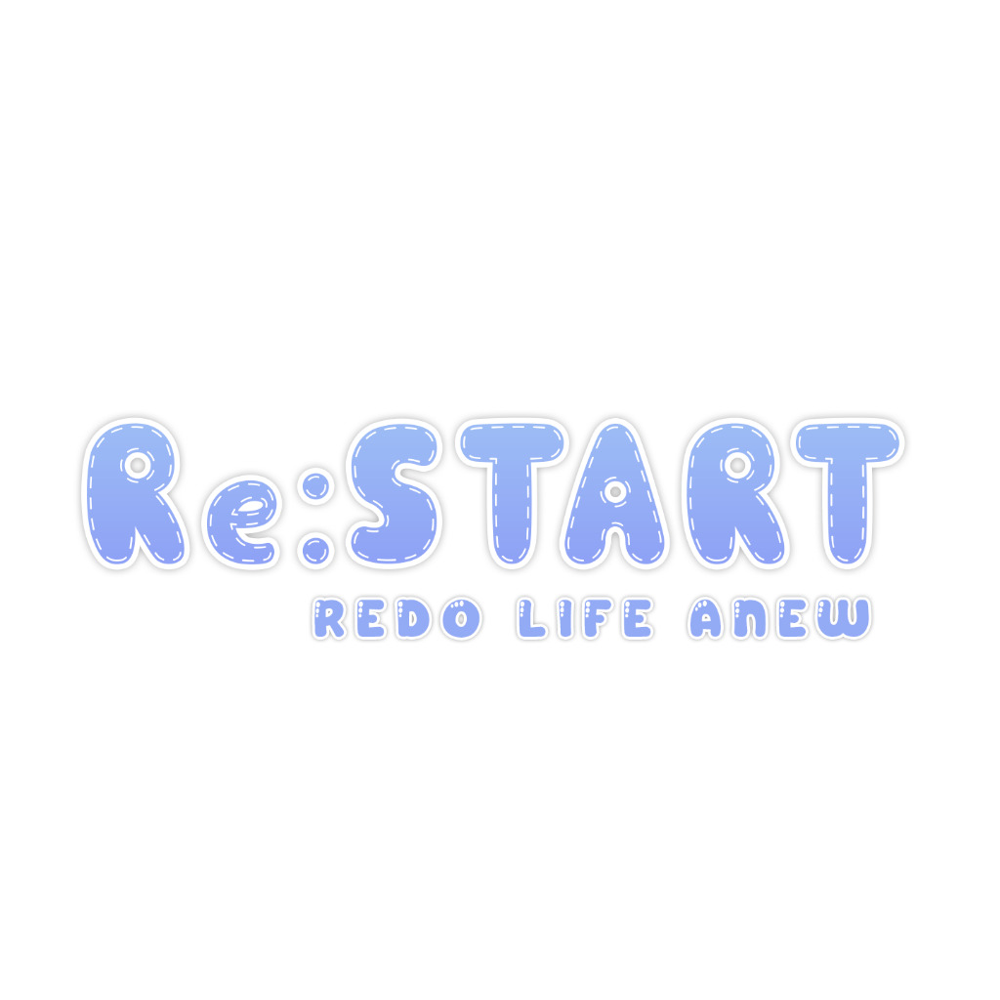

<div align="center">
  
  
  # ✨ Re:START Hub ✨
  
  **Redo Life Anew** • *A Cozy VRChat Friend Group & Portfolio Hub*
  
  [](https://vercel.com)
  [](https://nextjs.org/)
  [](https://css3.org)
</div>

---

## 💜 About the Project
Welcome to the official web hub for **Re:START**, a close-knit VRChat friend group! 🌸 

This website was designed and built to showcase the founders and members of our group, share our upcoming VRChat world meetups, sync with our Twitter updates, and bring our community closer together. It features a modern, interactive design inspired by high-end Virtual YouTuber agencies like Hololive.

---

## 🌟 Key Features

*   **🎬 Cinematic Splash Screen:** A beautiful entry animation featuring the glowing Re:START logo fading in and out with floating space particle effects.
*   **🌙 / ☀️ Interactive Theme Switcher:** Easily toggle between a **Light Pastel celestial sky** and a **Dark Starry Night space theme** with smooth CSS fade transitions.
*   **🎨 Hololive-Style Member Cards:** Tall portrait cards showing custom VRChat avatars. Hovering over a card reveals the name, handle, role, and custom-styled social links (Lore, Twitch, and Twitter/X) with smooth animations.
*   **👥 Divided Leader & Crew Roster:** Clear separated sections for **Meet the Founders** and **Meet the Crew** centered on any device size.
*   **📢 News & Updates (Twitter Feed):** A custom-designed, clickable mock feed connected directly to members' real Twitter accounts (like [@Aishikichu](https://x.com/aishikichu)).
*   **📅 Upcoming Events Calendar:** A detailed schedule for our weekly community meetups and world launches, featuring custom status badges and locations.
*   **✨ Particle Space Starfield:** A dynamic, floating starfield background that adjusts to the selected theme.

---

## 🛠️ How it Works & Tech Stack

This project is built using:
- **Next.js (App Router)** for fast page loading and structure.
- **React** for state-based components (theme toggling, splash screens, interactive layouts).
- **Vanilla CSS** for premium custom animations, transitions, and layout spacing.

### Project structure:
- 📂 `src/data/members.js`: Edit this file to add/remove members, update roles, Twitch links, custom background colors, and Twitter handles.
- 📂 `src/data/newsEvents.js`: Edit this to post new tweets or schedule upcoming VRChat events.
- 📂 `src/components/`: Modular UI sections (Navbar, Hero, NewsEvents, TalentRoster, ProfileCard, StarField).

---

## 🚀 Running Locally

1. Install dependencies:
   ```bash
   npm install
   ```

2. Run the development server:
   ```bash
   npm run dev
   ```

3. Open [http://localhost:3000](http://localhost:3000) in your browser.

---

<div align="center">
  Made with 💜 for the Re:START Crew. Redo Life Anew! ✨
</div>
